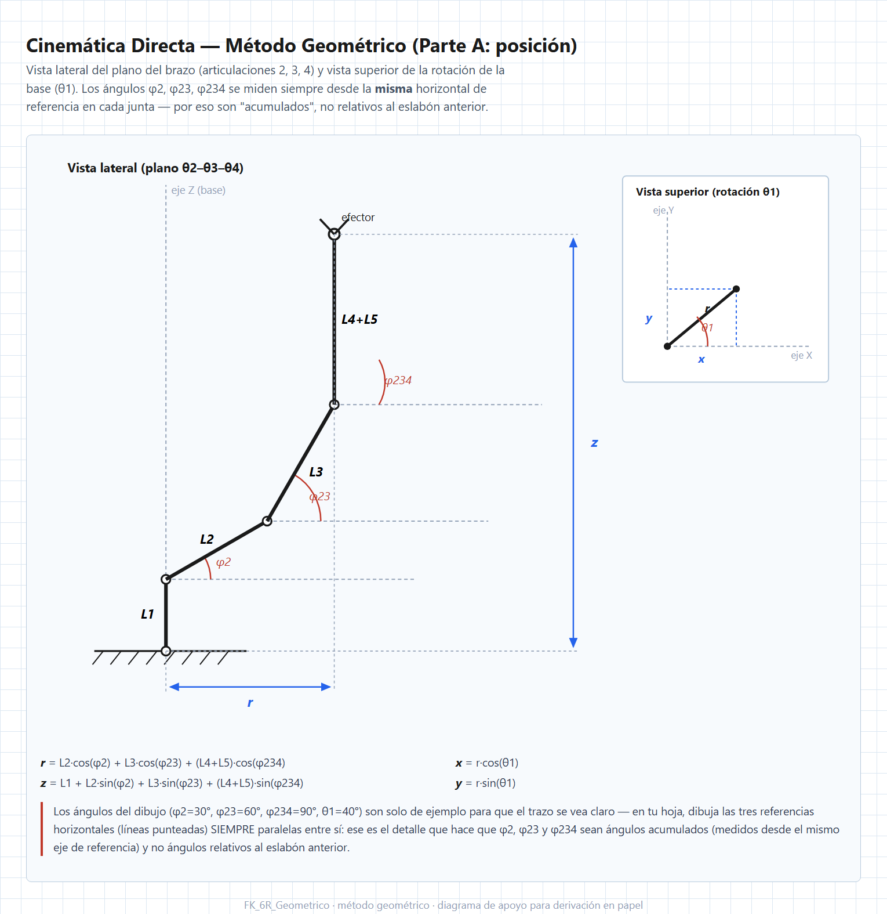
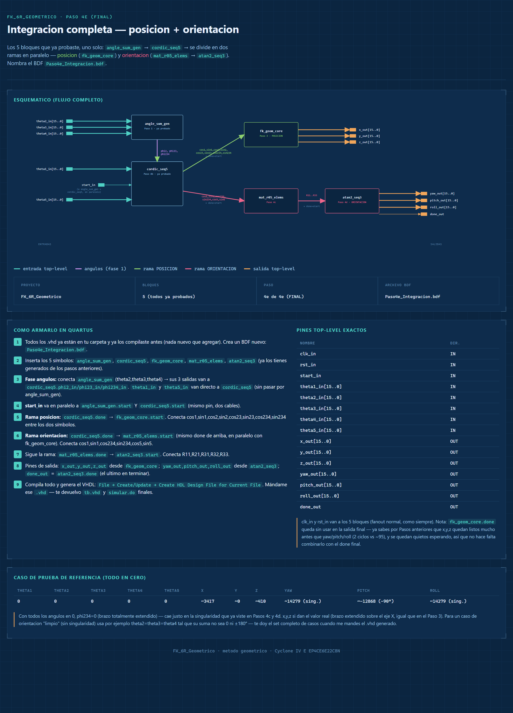

# Cinemática Directa 5R por Método Geométrico — Proyecto `FK_6R_Geometrico`

## Descripción General

Este módulo calcula la **cinemática directa completa** (posición `x,y,z` **y** orientación
`yaw,pitch,roll` del efector final) de un robot serial de 5 articulaciones revolutas + gripper,
usando el **método geométrico clásico** — el primero que se enseña en un curso de robótica,
antes de introducir matrices homogéneas o parámetros Denavit-Hartenberg.

Es la respuesta directa a un problema real que surgió después de las lecciones
[6](../6_Cinematica_Directa_Matrices_Homogeneas/README.md) y
[7](../7_Cinematica_Directa_DH/README.md): tanto el método de matrices homogéneas como el
método DH, al escalar de 2R a 5 eslabones, **saturan la FPGA**. El profesor del semillero pidió
explícitamente reducir elementos lógicos manteniendo la misma metodología de trabajo (BDF →
VHDL generado → testbench, paso a paso). Este documento explica por qué el atajo geométrico
es posible para *este* robot en particular, cómo se derivó matemáticamente, y cómo se tradujo
a hardware bloque por bloque.

> **Aritmética:** Punto fijo Q2.13 (16 bits con signo), igual que en el resto del semillero.
> **Plataforma:** Cyclone IV E (EP4CE6E22C8) · Quartus 18.1
> **Universidad Militar Nueva Granada**

---

## Tabla de Contenidos

1. [Por qué cambiar de método: el problema de recursos](#1-por-qué-cambiar-de-método-el-problema-de-recursos)
2. [Por qué este robot admite el atajo geométrico](#2-por-qué-este-robot-admite-el-atajo-geométrico)
3. [Derivación matemática, paso a paso](#3-derivación-matemática-paso-a-paso)
   - [3.1 Posición](#31-posición)
   - [3.2 De dónde salen `Rz(θ)` y `Rx(α)`](#32-de-dónde-salen-rzθ-y-rxα)
   - [3.3 Fórmula general por articulación y sustitución de cada `α`](#33-fórmula-general-por-articulación-y-sustitución-de-cada-α)
   - [3.4 Multiplicación en cadena: `R0_4 = R1·R2·R3·R4`](#34-multiplicación-en-cadena-r0_4--r1r2r3r4)
   - [3.5 Corrección: el eje de la muñeca (`θ5` rota sobre Z, no sobre X)](#35-corrección-el-eje-de-la-muñeca-θ5-rota-sobre-z-no-sobre-x)
   - [3.6 Ángulos de Euler ZYX: de dónde salen Yaw/Pitch/Roll](#36-ángulos-de-euler-zyx-de-dónde-salen-yawpitchroll)
4. [Arquitectura de módulos (hoja de ruta)](#4-arquitectura-de-módulos-hoja-de-ruta)
5. [Módulo por módulo](#5-módulo-por-módulo)
6. [Integración final: el BDF completo](#6-integración-final-el-bdf-completo)
7. [Testbench, casos de prueba y la singularidad](#7-testbench-casos-de-prueba-y-la-singularidad)
8. [Verificación en MATLAB](#8-verificación-en-matlab)
9. [Cómo compilar y simular](#9-cómo-compilar-y-simular)
10. [Comparación de recursos: geométrico vs. DH](#10-comparación-de-recursos-geométrico-vs-dh)

---

## 1. Por qué cambiar de método: el problema de recursos

El proyecto `Fk6R_DH` de la [lección 7](../7_Cinematica_Directa_DH/README.md) escala el método
DH a 5 eslabones instanciando 5 bloques `t_dh_gen` (cada uno con su propio CORDIC de 13 ciclos)
y 4 bloques `mat4x4_mul` (16 multiplicaciones Q2.13 en paralelo cada uno) encadenados. El
reporte del *fitter* de ese proyecto, compilado contra la misma Cyclone IV E de este semillero,
da:

| Recurso | Usado | Disponible (EP4CE6) | % |
|---|---|---|---|
| Logic elements | 55,391 | 6,272 | **883 %** |
| Multiplicadores embebidos 9-bit | 30 | 30 | 100 % |
| **Fitter Status** | | | **Failed** |

No cabe ni remotamente en la FPGA del semillero. El cuello de botella son los 4
multiplicadores de matriz 4×4 (16 productos + 12 sumas cada uno) y los 5 CORDIC corriendo en
paralelo. Cambiar de arquitectura (sin cambiar de robot ni de resultado matemático) es la
única forma de que este cálculo quepa en la tarjeta.

---

## 2. Por qué este robot admite el atajo geométrico

Con la asignación de ejes DH del robot (ver lección 7, sección 2, para la tabla completa de
parámetros DH), la geometría real es la de un manipulador tipo **codo** con muñeca simple:

- **θ1** rota toda la cadena alrededor de `Z0` (la base) — no cambia la geometría *dentro* del
  plano del brazo, solo orienta ese plano respecto al mundo.
- **θ2, θ3, θ4** son tres articulaciones **coplanares** (todas paralelas entre sí): doblan el
  brazo dentro de un mismo plano vertical, cada una heredando la inclinación acumulada de las
  anteriores.
- **θ5** rota el gripper únicamente sobre su propio eje — es un *roll* puro que **no mueve la
  posición** del efector, solo su orientación final.

Como consecuencia, la posición `(x,y,z)` del efector se puede obtener con trigonometría plana
directa (proyectar cada eslabón sobre el plano del brazo y luego rotar ese plano por `θ1`), sin
necesidad de multiplicar ninguna matriz 4×4. Las longitudes de eslabón usadas son:

| Eslabón | Longitud real | Q2.13 (`raw = round(m·8192)`) |
|---|---|---|
| `L1` (base → hombro) | 0.05 m | 410 |
| `L2` | 0.107 m | 877 |
| `L3` | 0.13 m | 1065 |
| `L4 + L5` | 0.07 + 0.11 = 0.18 m | 1475 |

`L4` y `L5` se suman en una sola constante porque, según el punto anterior, `θ5` no cambia la
posición — el tramo final del brazo (`L4+L5`) se comporta, para efectos de posición, como una
prolongación rígida del eslabón 3.

---

## 3. Derivación matemática, paso a paso

Esta sección reconstruye la derivación completa **desde cero**, tal como se hizo en papel para
presentarla al profesor de semillero — no solo el resultado final, sino de dónde sale cada
matriz y cada sustitución. Se puede reproducir en MATLAB con
[`Metodo_Geometrico_RPY.m`](Metodo_Geometrico_RPY.m) (numérico, matriz por matriz) o
[`Metodo_Geometrico_RPY_Simbolico.m`](Metodo_Geometrico_RPY_Simbolico.m) (mismo código, con
`syms` en vez de números) — ver [sección 8](#8-verificación-en-matlab).

### 3.1 Posición

Con `φ2 = θ2`, `φ23 = θ2+θ3`, `φ234 = θ2+θ3+θ4` (los ángulos **acumulados** de cada eslabón
respecto al eje de referencia — ver el diagrama abajo, donde las tres líneas de referencia
horizontales son **paralelas entre sí**, que es justo lo que hace que estos ángulos sean
acumulados y no relativos al eslabón anterior):



```
r = L2·cos(φ2) + L3·cos(φ23) + (L4+L5)·cos(φ234)      (alcance radial, dentro del plano)
z = L1 + L2·sin(φ2) + L3·sin(φ23) + (L4+L5)·sin(φ234)  (altura)
x = r·cos(θ1)
y = r·sin(θ1)
```

### 3.2 De dónde salen `Rz(θ)` y `Rx(α)`

Antes de construir la matriz de orientación hace falta un paso más atrás: de dónde salen las
matrices básicas de rotación. Un hecho de álgebra lineal: la matriz de una transformación
lineal se arma poniendo **a dónde va cada eje** `X=(1,0,0)`, `Y=(0,1,0)`, `Z=(0,0,1)` como
columnas.

**`Rz(θ)` — rotación alrededor de Z.** El eje Z no se mueve. Un vector a lo largo de X (ángulo
0°) rotado `θ` queda a `θ`, es decir en `(cosθ, sinθ, 0)` (definición de seno/coseno en el
círculo unitario). Un vector a lo largo de Y (ángulo 90°) rotado `θ` queda a `90°+θ`, es decir
`(cos(90°+θ), sin(90°+θ), 0) = (-sinθ, cosθ, 0)`. Poniendo estos resultados como columnas:

```
Rz(θ) = [ cosθ   -sinθ    0 ]
        [ sinθ    cosθ    0 ]
        [  0        0     1 ]
```

**`Rx(α)` — rotación alrededor de X.** Mismo procedimiento, ahora el que no se mueve es X:

```
Rx(α) = [ 1     0        0   ]
        [ 0    cosα   -sinα ]
        [ 0    sinα    cosα ]
```

Cada articulación DH hace dos rotaciones en cadena: primero gira el ángulo variable de la junta
sobre Z (`Rz(θᵢ)`), luego aplica la torsión fija del eslabón sobre X (`Rx(αᵢ)`):

```
Rᵢ = Rz(θᵢ) · Rx(αᵢ)
   = [ cosθᵢ   -sinθᵢ·cosαᵢ    sinθᵢ·sinαᵢ ]
     [ sinθᵢ    cosθᵢ·cosαᵢ   -cosθᵢ·sinαᵢ ]
     [   0          sinαᵢ          cosαᵢ    ]
```

### 3.3 Fórmula general por articulación y sustitución de cada `α`

Ahora se mete el número de `α` de cada articulación (según la tabla DH de la lección 7) en la
fórmula general y se ve qué le pasa a cada una de las 9 casillas.

**Articulación 1 (`α1=90°`):** con `cos90°=0, sin90°=1`:

```
R1(1,1) = cosθ1                    R1(1,2) = -sinθ1·cosα1 = 0        R1(1,3) = sinθ1·sinα1 = sinθ1
R1(2,1) = sinθ1                    R1(2,2) =  cosθ1·cosα1 = 0        R1(2,3) = -cosθ1·sinα1 = -cosθ1
R1(3,1) = 0                        R1(3,2) = sinα1 = 1               R1(3,3) = cosα1 = 0

R1 = [ cosθ1    0    sinθ1 ]
     [ sinθ1    0   -cosθ1 ]
     [   0      1      0   ]
```

Físicamente, `α=90°` es la torsión que reorienta el eje: convierte la rotación vertical de la
base (`θ1`) en el eje horizontal sobre el que giran las siguientes articulaciones.

**Articulaciones 2 y 3 (`α=0°`):** con `cos0°=1, sin0°=0`, todos los términos con `sinα` se
anulan y los términos con `cosα` quedan intactos:

```
R = [ cosθ  -sinθ   0 ]
    [ sinθ   cosθ   0 ]      = Rz(θ)     (rotación pura, sin mezclar la 3ra fila/columna)
    [   0      0    1 ]
```

`α=0°` significa "sin torsión": el eje de giro no cambia de dirección, la rotación se queda
pura en el plano. Esta es la razón matemática de por qué los eslabones 2 y 3 son coplanares.

**Articulación 4 (`α4=90°`, con `θ4' = θ4+90°`):** mismo caso que la articulación 1, pero el
ángulo variable no es `θ4` directo sino `θ4'=θ4+90°` (desfase fijo de la tabla DH, no algo que
se derive). Sustituyendo primero como en la articulación 1:

```
R4 = [ cosθ4'    0    sinθ4' ]
     [ sinθ4'    0   -cosθ4' ]
     [   0       1      0    ]
```

y ahora reemplazando `θ4'` por `θ4+90°` con las identidades de suma de ángulos:

```
cos(θ4+90°) = cosθ4·cos90° - sinθ4·sin90° = -sinθ4
sin(θ4+90°) = sinθ4·cos90° + cosθ4·sin90° =  cosθ4

R4 = [ -sinθ4    0    cosθ4 ]
     [  cosθ4    0    sinθ4 ]
     [   0       1      0   ]
```

### 3.4 Multiplicación en cadena: `R0_4 = R1·R2·R3·R4`

**Paso intermedio — por qué `R2·R3 = Rz(φ23)`:** multiplicando fila×columna con las
identidades `cos(a+b)=cosacosb-sinasinb` y `sin(a+b)=sinacosb+cosasinb`:

```
(R2·R3)11 = cosθ2cosθ3 - sinθ2sinθ3 = cos(θ2+θ3)      (R2·R3)12 = -sin(θ2+θ3)
(R2·R3)21 = sin(θ2+θ3)                                 (R2·R3)22 =  cos(θ2+θ3)

R2·R3 = Rz(θ2+θ3) = Rz(φ23)
```

No es un atajo mágico: dos rotaciones seguidas sobre el mismo eje se suman porque eso es lo que
sale de multiplicar las matrices.

**`A = R1 · Rz(φ23)`** (fila de `R1` · columna de `Rz(φ23)`, entrada por entrada):

```
A11 = cosθ1·cosφ23                  A12 = -cosθ1·sinφ23                A13 = sinθ1
A21 = sinθ1·cosφ23                  A22 = -sinθ1·sinφ23                A23 = -cosθ1
A31 = sinφ23                        A32 =  cosφ23                      A33 = 0
```

**`R0_4 = A · R4`**, usando otra vez suma de ángulos (`φ234 = φ23+θ4`):

```
R0_4(1,1) = A11·(-sinθ4) + A12·cosθ4 = -cosθ1·(cosφ23·sinθ4 + sinφ23·cosθ4) = -cosθ1·sinφ234
R0_4(1,2) = A13 = sinθ1
R0_4(1,3) = A11·cosθ4 + A12·sinθ4 = cosθ1·(cosφ23·cosθ4 - sinφ23·sinθ4) = cosθ1·cosφ234

R0_4(2,1) = -sinθ1·sinφ234          R0_4(2,2) = -cosθ1          R0_4(2,3) = sinθ1·cosφ234

R0_4(3,1) = A31·(-sinθ4) + A32·cosθ4 = cosφ23·cosθ4 - sinφ23·sinθ4 = cosφ234
R0_4(3,2) = A33 = 0
R0_4(3,3) = A31·cosθ4 + A32·sinθ4 = sinφ23·cosθ4 + cosφ23·sinθ4 = sinφ234
```

```
R0_4 = [ -cosθ1·sinφ234    sinθ1     cosθ1·cosφ234 ]
       [ -sinθ1·sinφ234   -cosθ1     sinθ1·cosφ234 ]
       [   cosφ234           0         sinφ234       ]
```

### 3.5 Corrección: el eje de la muñeca (`θ5` rota sobre Z, no sobre X)

**Primer intento (incorrecto).** La primera versión de este documento asumía
`R0_5 = R0_4 · Rx(θ5)` — razonando que `θ5` gira "sobre la dirección a lo largo del brazo", y
asumiendo sin verificarlo que esa dirección era el eje local `X` de la muñeca. Con esa
suposición, la columna 1 de `R0_4` quedaba intacta (`R11,R21,R31` sin `θ5`) y solo `R32,R33`
dependían de `θ5`.

**La corrección, en la revisión con el profesor.** Mirando el diagrama de asignación de ejes
del brazo (frame 3/4, con las etiquetas **`X3,Z4`**), la dirección "a lo largo del brazo" está
etiquetada como el eje **`Z4`**, no `X4`. Y la convención DH es tajante: en
`Tᵢ = Rz(θᵢ)·Trans_z(dᵢ)·Trans_x(aᵢ)·Rx(αᵢ)`, el ángulo variable `θᵢ` **siempre** rota sobre Z
— sin excepciones. La fila 5 de la tabla DH (`θ5, d5=L5, α5=0, a5=0`) confirma que
`T45 = Rz(θ5)·Trans_z(L5)`: rotación en Z. El propio script de verificación DH del semillero
(`Metodo_DH_RPY_Comparacion.m`) usa la misma convención: la quinta transformación se llama
`thetaZ5`, exactamente como las otras cuatro — nunca hubo una "muñeca sobre X" en la convención
DH, fue un error de interpretación en la primera derivación geométrica.

**Rehaciendo el Paso 8 con `Rz(θ5)` (correcto):**

```
Rz(θ5) = [ cosθ5   -sinθ5    0 ]
         [ sinθ5    cosθ5    0 ]
         [   0        0      1 ]
```

Con `B = R0_4`, las columnas de `Rz(θ5)` son `(cosθ5,sinθ5,0)`, `(-sinθ5,cosθ5,0)`, `(0,0,1)`:

```
R0_5(i,1) = Bi1·cosθ5 + Bi2·sinθ5
R0_5(i,2) = Bi1·(-sinθ5) + Bi2·cosθ5
R0_5(i,3) = Bi3                        <- esta columna (la 3, no la 1) es la que NO cambia
```

```
R11 = -cosθ1·sinφ234·cosθ5 + sinθ1·sinθ5
R21 = -sinθ1·sinφ234·cosθ5 - cosθ1·sinθ5
R31 =  cosφ234·cosθ5

R32 = -cosφ234·sinθ5
R33 =  sinφ234                    <- ya no depende de theta5
```

**Verificación cruzada.** Para `θ1=45°, φ234=90°, θ5=45°`, la matriz `R0_5` completa (las 9
casillas) se reduce a `[0,1,0; -1,0,0; 0,0,1]` — exactamente `Rz(-90°)`. Es autoconsistente:
cuando el brazo apunta derecho hacia arriba (`φ234=90°`), el eje de la muñeca (`Z4`) queda
paralelo al eje vertical del mundo, y la rotación de la base (`θ1`) y el roll de la muñeca
(`θ5`) terminan acoplados en un único giro neto alrededor de ese eje vertical — un
comportamiento físicamente razonable, no un capricho del álgebra.

`mat_r05_elems.vhd` (sección 5.5) implementa estas 5 fórmulas corregidas, en 2 ciclos en vez de
1 (hacen falta más productos intermedios que con el modelo incorrecto).

### 3.6 Ángulos de Euler ZYX: de dónde salen Yaw/Pitch/Roll

Con `Rzyx(yaw,pitch,roll) = Rz(yaw)·Ry(pitch)·Rx(roll)` (la matriz general de la clase de
teoría), comparando entrada por entrada:

```
Rzyx = [ Cp·Cy    Sr·Sp·Cy - Cr·Sy    Cr·Sp·Cy + Sr·Sy ]
       [ Cp·Sy    Sr·Sp·Sy + Cr·Cy    Cr·Sp·Sy - Sr·Cy ]
       [  -Sp        Sr·Cp                 Cr·Cp        ]
```

(`C`=coseno, `S`=seno; `y`=yaw, `p`=pitch, `r`=roll — noten que este "r" de roll no tiene nada
que ver con el `R` de la matriz de rotación). De ahí:

```
R11 = Cp·Cy      R21 = Cp·Sy      R31 = -Sp      R32 = Sr·Cp      R33 = Cr·Cp
```

**Despejando cada ángulo:**

```
R21/R11 = Sy/Cy = tan(yaw)                              -> yaw   = atan2(R21, R11)
R11² + R21² = Cp²(Cy²+Sy²) = Cp²  ,  R31 = -Sp           -> pitch = atan2(-R31, √(R11²+R21²))
R32/R33 = Sr/Cr = tan(roll)                              -> roll  = atan2(R32, R33)
```

con singularidad en `pitch = ±90°` (cuando `Cp → 0`, el denominador de yaw y roll se anula —
es el clásico *gimbal lock*: en `pitch=±90°`, `Rz(yaw)·Ry(±90°)·Rx(roll)` se reduce a depender
solo de `yaw+roll`, nunca de los dos por separado, así que hay infinitas parejas `(yaw,roll)`
igualmente válidas para la misma orientación física — dos algoritmos distintos pueden repartir
esa suma de forma diferente sin que ninguno esté "mal": la comprobación real no es que
`yaw`/`roll` coincidan entre métodos, sino que `Rz(yaw)·Ry(pitch)·Rx(roll)` reconstruya la
misma `R05` en cualquiera de los dos repartos).

Sustituyendo los `R_ij` de la sección 3.5 (ya con la corrección de `θ5`), la extracción se
vuelve más enredada que con el modelo incorrecto — `yaw`, `pitch` y `roll` ya no se simplifican
limpiamente a `θ1`/`f(φ234)`/`θ5` por separado, porque ahora `θ5` también aparece dentro de
`R11`, `R21` y `R31`.

**Condición exacta de la singularidad (corregida).** Como la columna 1 de cualquier matriz de
rotación es un vector unitario, `R11²+R21²+R31²=1` siempre. Con `R31=cosφ234·cosθ5`:

```
R11² + R21² = 1 - (cosφ234·cosθ5)²
```

Esto se anula (la singularidad) únicamente cuando `cosφ234·cosθ5 = ±1` — y como ninguno de los
dos factores puede pasar de 1 en magnitud, eso exige que **los dos sean `±1` al mismo tiempo**:

```
sin(φ234) = 0   Y   sin(θ5) = 0     (simultaneamente)
```

Es decir, el brazo extendido/plegado en línea recta **y** la muñeca en `θ5=0°` o `180°`, al
mismo tiempo — no basta con que el brazo esté extendido si `θ5≠0,180°`. (Una versión anterior
de este documento afirmaba que bastaba `sin(φ234)=0`; esa condición era la del modelo `Rx(θ5)`
incorrecto de la sección 3.5, no la del modelo corregido.)

---

## 4. Arquitectura de módulos (hoja de ruta)

Todo el diseño gira sobre un único recurso reutilizado: el **CORDIC** (COordinate Rotation
DIgital Computer), que calcula seno/coseno/`atan2` usando solo sumas, restas y corrimientos de
bits — sin multiplicadores ni tablas trigonométricas. Existen dos modos, ambos ya introducidos
en la [lección 5](../5_2R_Inverse_Cinematic/Operadores.md):

- **Modo rotación** (`cordic_sincos_16`, lección 5): dado un ángulo, devuelve su seno/coseno.
- **Modo *vectoring*** (variante nueva `cordic_atan2_16`, sección 5.6): dado un vector `(x,y)`,
  devuelve `atan2(y,x)` **y**, de regalo, `sqrt(x²+y²)`.

La decisión de diseño central (a diferencia de los métodos de las lecciones 6 y 7, que
instancian un CORDIC físico por cada ángulo) es: **una sola copia física de cada CORDIC,
reutilizada varias veces en secuencia** mediante una máquina de estados. Eso reduce
drásticamente el conteo de multiplicadores embebidos y elementos lógicos, a cambio de más
ciclos de latencia.

| Paso | Módulo | Qué hace | Latencia |
|---|---|---|---|
| 0 | `geom_pkg.vhd` | Constantes de eslabón + reducción angular | — (paquete) |
| 1 | `angle_sum_gen.vhd` | `θ2,θ3,θ4 → φ2,φ23,φ234` | 1 ciclo |
| 2 | `cordic_seq5.vhd` | 1 CORDIC reutilizado en 5 pasadas: `θ1,φ2,φ23,φ234,θ5 →` senos/cosenos | ~65 ciclos |
| 3 | `fk_geom_core.vhd` | Posición `x,y,z` (rama posición) | 2 ciclos |
| 4a | `cordic_atan2_16.vhd` | CORDIC modo *vectoring* (bloque base, se prueba aislado) | 13 ciclos |
| 4b | (incluido en `cordic_seq5`) | — | — |
| 4c | `mat_r05_elems.vhd` | Elementos `R11,R21,R31,R32,R33` (rama orientación) | 2 ciclos |
| 4d | `atan2_seq3.vhd` | 1 CORDIC *vectoring* reutilizado en 3 pasadas: `→ yaw,pitch,roll` | ~40 ciclos |
| 4e | Integración final (BDF) | Encadena todo: `θ1..θ5 → x,y,z,yaw,pitch,roll` | ~106-116 ciclos |

Cada paso se armó y probó **por separado** en Quartus (diagrama de bloques → VHDL generado →
testbench propio) antes de integrarlo, siguiendo la misma metodología de las lecciones
anteriores.

---

## 5. Módulo por módulo

### 5.1 `geom_pkg.vhd` — constantes y reducción angular

No es un circuito: es un paquete VHDL con las longitudes de eslabón en Q2.13 y una función
`wrap_to_pi` que reduce cualquier suma de ángulos (que puede pasarse de `±180°`) de vuelta al
rango que espera el CORDIC.

```vhdl
constant L1_Q13  : signed(15 downto 0) := to_signed(  410, 16);  -- 0.05  m
constant L2_Q13  : signed(15 downto 0) := to_signed(  877, 16);  -- 0.107 m
constant L3_Q13  : signed(15 downto 0) := to_signed( 1065, 16);  -- 0.13  m
constant L45_Q13 : signed(15 downto 0) := to_signed( 1475, 16);  -- L4+L5 = 0.18 m

function wrap_to_pi(a : signed(17 downto 0)) return signed;
```

### 5.2 `angle_sum_gen.vhd` — ángulos acumulados

Toma `θ2,θ3,θ4` (lo que mueve cada motor, relativo al eslabón anterior) y calcula los ángulos
**absolutos** acumulados `φ2 = θ2`, `φ23 = θ2+θ3`, `φ234 = θ2+θ3+θ4`. Solo sumas — sin
trigonometría, sin CORDIC. 1 ciclo de latencia.

### 5.3 `cordic_seq5.vhd` — un solo CORDIC, cinco pasadas

El corazón del ahorro de área. Adentro hay **una sola** instancia de `cordic_sincos_16` (la
misma de la lección 5, sin modificar). Una máquina de estados (`S_IDLE → S_W1 → S_W2 → S_W3 →
S_W4 → S_W5`) le mete, una tras otra, las 5 pasadas — `θ1`, `φ2`, `φ23`, `φ234`, `θ5` —
guardando el seno/coseno de cada una en un registro antes de arrancar la siguiente:

```vhdl
when S_W1 =>
    if cordic_done = '1' then
        cos1_r       <= cordic_cos;
        sin1_r       <= cordic_sin;
        angle_mux    <= phi2_in;
        cordic_start <= '1';
        state        <= S_W2;
    end if;
```

Latencia total ≈ 5×13 = 65 ciclos — el precio de compartir un solo CORDIC físico entre 5
ángulos en vez de instanciar 5 copias en paralelo (como haría el método DH).

### 5.4 `fk_geom_core.vhd` — posición (rama 1 de 2)

Con los senos/cosenos ya calculados, arma la posición en 2 etapas:

```vhdl
-- etapa 1
r_v := mul_q13(L2_Q13, signed(cos2_in))
     + mul_q13(L3_Q13, signed(cos23_in))
     + mul_q13(L45_Q13, signed(cos234_in));
z_v := L1_Q13
     + mul_q13(L2_Q13, signed(sin2_in))
     + mul_q13(L3_Q13, signed(sin23_in))
     + mul_q13(L45_Q13, signed(sin234_in));
-- etapa 2
x_r <= mul_q13(r_r, cos1_r);
y_r <= mul_q13(r_r, sin1_r);
```

Solo multiplicaciones simples (`mul_q13`, el mismo operador de la lección 5) y sumas — sin
CORDIC adicional, sin matrices. 2 ciclos de latencia.

### 5.5 `mat_r05_elems.vhd` — elementos de rotación (rama 2 de 2, parte 1)

Arma los 5 elementos de `R0_5` corregidos (sección 3.5), con productos simples en 2 etapas —
la etapa 1 calcula los productos intermedios `cos1·sin234` y `sin1·sin234` (que hacen falta
para combinar con `cos5`/`sin5` en la etapa 2, ya que ahora `θ5` mezcla la columna 1 en vez de
dejarla intacta):

```vhdl
-- etapa 1
a_r      <= mul_q13(signed(cos1_in), signed(sin234_in));   -- cos1*sin234
b_r      <= mul_q13(signed(sin1_in), signed(sin234_in));   -- sin1*sin234
-- (cos1_r, sin1_r, cos234_r, sin234_r, cos5_r, sin5_r se capturan tal cual)

-- etapa 2:  R0_5 = R0_4 * Rz(theta5)
r11_r <= -mul_q13(a_r, cos5_r) + mul_q13(sin1_r, sin5_r);
r21_r <= -mul_q13(b_r, cos5_r) - mul_q13(cos1_r, sin5_r);
r31_r <=  mul_q13(cos234_r, cos5_r);
r32_r <= -mul_q13(cos234_r, sin5_r);
r33_r <=  sin234_r;
```

2 ciclos de latencia (antes era 1 ciclo, con la fórmula incorrecta — ver sección 3.5).

### 5.6 `cordic_atan2_16.vhd` — CORDIC modo *vectoring* con magnitud

Variante del `cordic_atan2.vhd` de la [lección 5](../5_2R_Inverse_Cinematic/Atan2.md): en vez
de girar un vector un ángulo **conocido** (modo rotación), gira el vector de entrada `(x,y)`
**hasta que su componente Y llega a cero**. El ángulo acumulado en el camino es `atan2(y,x)`, y
la magnitud final del vector (compensada por la ganancia `K` del CORDIC) es `sqrt(x²+y²)` —
esto último es la novedad respecto al `cordic_atan2.vhd` original, y resulta clave para poder
encadenar tres pasadas (sección 5.7) sin necesitar un `sqrt` aparte.

```vhdl
-- Correccion de cuadrante: si x<0, rotar 180 grados antes de iterar
if x_s < 0 then
    x_pipe(0) <= -x_s;  y_pipe(0) <= -y_s;
    if y_s >= 0 then z_pipe(0) <= PI_Q13; else z_pipe(0) <= -PI_Q13; end if;
else
    x_pipe(0) <= x_s;   y_pipe(0) <= y_s;   z_pipe(0) <= (others => '0');
end if;
...
angle_out <= std_logic_vector(z_pipe(N_ITER));
mag_out   <= std_logic_vector(mul_q13(x_pipe(N_ITER), CORDIC_K));
```

13 ciclos de latencia (igual que el CORDIC de rotación).

### 5.7 `atan2_seq3.vhd` — un solo CORDIC *vectoring*, tres pasadas (con dependencia real)

Misma filosofía que `cordic_seq5`, pero reutilizando `cordic_atan2_16`:

```
Pasada 1: x=R11, y=R21   -> angle = Yaw,   mag = rho = sqrt(R11²+R21²)
Pasada 2: x=rho, y=-R31  -> angle = Pitch          (usa el rho de la pasada 1)
Pasada 3: x=R33, y=R32   -> angle = Roll
```

A diferencia de `cordic_seq5` (cuyas 5 pasadas son independientes entre sí), aquí la **pasada 2
depende del resultado de la pasada 1** (`rho` no es un dato de entrada, sale del cálculo
anterior) — es una dependencia de datos real, no solo una reutilización de hardware. Por eso
este bloque se probó aislado antes de integrarlo (ver `images/Paso4d_diagrama.png`).

---

## 6. Integración final: el BDF completo



El flujo completo, de entradas a salidas:

```
θ1..θ5  ->  angle_sum_gen (θ2,θ3,θ4) ->  φ2,φ23,φ234  \
                                                          -> cordic_seq5 (5 pasadas)  ->  { rama posición, rama orientación }
θ1, θ5 ------------------------------------------------/
```

`start_in` dispara `angle_sum_gen` y `cordic_seq5` **en paralelo** (no en cadena) — como
`angle_sum_gen` solo tarda 1 ciclo, sus salidas están listas mucho antes de que `cordic_seq5`
las necesite (~13 ciclos después, al terminar la primera pasada). Cuando `cordic_seq5.done` se
activa, dispara **en paralelo** las dos ramas:

- **Rama posición** (verde): `cordic_seq5 → fk_geom_core → x_out,y_out,z_out`. Termina rápido
  (2 ciclos).
- **Rama orientación** (rosa): `cordic_seq5 → mat_r05_elems → atan2_seq3 →
  yaw_out,pitch_out,roll_out`. Termina mucho después (~40 ciclos más), porque es la que
  reutiliza el CORDIC *vectoring* tres veces.

El `done_out` final del top-level es el de `atan2_seq3` — el **último** en terminar. Los
`done` de `angle_sum_gen` y `fk_geom_core` se dejan **sin conectar** a propósito: no hace falta
sincronizar con ellos porque, o bien sus salidas ya están listas con anticipación (caso
`angle_sum_gen`), o bien terminan mucho antes que la señal de `done` que sí importa y sus
salidas se quedan quietas esperando (caso `fk_geom_core`).

Diagramas de conexión intermedios (para armar cada bloque por separado antes de la integración
final):

| Paso | Diagrama | Qué prueba |
|---|---|---|
| 4a | `images/Paso4a_diagrama.png` | `cordic_atan2_16` aislado (5 casos: 0°, 90°, 180°, -90°, 53.13°) |
| 4b+4c | `images/Paso4bc_diagrama.png` | `cordic_seq5` + `mat_r05_elems` en cascada |
| 4d | `images/Paso4d_diagrama.png` | `atan2_seq3` aislado (incluye el caso de singularidad) |
| 4e | `images/Paso4e_diagrama.png` | Integración completa (este documento) |

---

## 7. Testbench, casos de prueba y la singularidad

> **Nota:** esta tabla ya refleja la corrección de la sección 3.5 (`θ5` sobre Z). Los Casos 1 y
> 3 no cambian respecto a la versión anterior de este documento porque en ambos `θ5=0`
> (`Rz(0)=Rx(0)=identidad`, así que el error no tenía forma de manifestarse ahí). El Caso 2 es
> el único con `θ5≠0` **y** `φ234≠0` al mismo tiempo, y sí cambia — ver más abajo.

Los 3 casos de prueba finales (`theta1..theta5` en grados; salidas en raw Q2.13):

| Caso | θ1,θ2,θ3,θ4,θ5 | x | y | z | yaw | pitch | roll |
|---|---|---|---|---|---|---|---|
| 1 — singularidad (`φ234=0` y `θ5=0`) | `0,0,0,0,0` | 3422 | 3 | 412 | 26363* | -12865 | 627* |
| 2 — limpio | `45,0,0,90,45` | 1375 | 1374 | 1887 | -12868‡ | ~0 | ~0 |
| 3 — limpio | `0,45,0,0,0` | 2418 | 2 | 2826 | -25733† | -6433 | 3 |

Posición y *pitch* coinciden con el valor esperado en los 3 casos, dentro del margen normal del
CORDIC (±0.02°–0.1°). Tres observaciones importantes:

**(‡) Caso 2 — el valor cambió con la corrección.** Antes (con el modelo `Rx(θ5)` incorrecto)
este caso daba `yaw≈-135°, roll≈45°`. Con el modelo corregido (`Rz(θ5)`), la matriz `R0_5`
completa para esta configuración se reduce exactamente a `Rz(-90°)` (ver la verificación
cruzada de la sección 3.5) — el resultado esperado ahora es `yaw≈-90°, pitch≈0°, roll≈0°`.
Pendiente confirmar con una nueva corrida de simulación tras aplicar el fix a
`mat_r05_elems.vhd`.

**(\*) Caso 1 — inestabilidad numérica real en la singularidad.** Con `φ234=0` y `θ5=0`
(la condición doble de la sección 3.6), `R11`, `R21`, `R32` y `R33` no llegan como ceros
matemáticos exactos sino como **residuos de redondeo del CORDIC** (`cos1`, `sin234`, etc.
tienen su propio error de ±0.02°). El resultado es que `yaw`/`roll` calculan `atan2` de un
vector prácticamente nulo, cuyo ángulo resultante es extremadamente sensible a ese ruido de
redondeo — puede salir literalmente cualquier valor. Esto pasa incluso en MATLAB de doble
precisión (por el truncamiento de `π/2`, ver más abajo), no es exclusivo del hardware.

En esta singularidad, `yaw` y `roll` individuales **no son verificables** entre distintos
métodos — solo `yaw+roll` lo es (sección 3.6 explica por qué). La forma correcta de validar
un caso así (sugerida por el profesor del semillero) no es comparar `yaw`/`roll` directo, sino
**reconstruir** `Rz(yaw)·Ry(pitch)·Rx(roll)` con los ángulos obtenidos y verificar que
reproduce la misma `R05` — ver `Metodo_Geometrico_RPY.m`, bloque final. Si el error de
reconstrucción da ~0, la extracción es correcta aunque el reparto `yaw`/`roll` no coincida con
otro algoritmo (p. ej. `tr2rpy`). Es la confirmación en hardware real del *gimbal lock*
descrito en la sección 3.6, no un bug.

**(†) Caso 3 — el corte de ±180°.** `+180°` y `-180°` son el mismo ángulo físico (es el punto
de discontinuidad de `atan2`). Como aquí `R11` es muy negativo y `R21` casi cero (con signo
dependiente del mismo ruido de redondeo), el resultado cae de un lado u otro del corte — la
*magnitud* es correcta (`25733 ≈ 25736 ≈ 180°`), solo cambia el signo de representación.

---

## 8. Verificación en MATLAB

Hay tres scripts, cada uno para un propósito distinto:

### [`Metodo_Geometrico_RPY.m`](Metodo_Geometrico_RPY.m) — construcción matriz por matriz

Reproduce la derivación completa de la sección 3 en MATLAB **numérico** (sin símbolos), en el
mismo estilo directo que el código DH ya existente del semillero: cada `Rᵢ` se arma con la
fórmula general (`cosθ, -sinθ·cosα, sinθ·sinα; ...`), sustituyendo el `α` de cada articulación
como número — sin resumir ni simplificar a mano, para que se vea exactamente cómo queda cada
matriz:

```matlab
% ===================== Articulacion 4 (con el desfase +pi/2 de la tabla DH) =====================
theta4 = pi/2;
alpha4 = pi/2;

R4 = [cos(theta4+pi/2)  -sin(theta4+pi/2)*cos(alpha4)   sin(theta4+pi/2)*sin(alpha4);
      sin(theta4+pi/2)   cos(theta4+pi/2)*cos(alpha4)  -cos(theta4+pi/2)*sin(alpha4);
             0                    sin(alpha4)                   cos(alpha4)          ]

% ===================== Articulacion 5 -- muñeca (rota sobre Z, no sobre X) =====================
theta5 = pi/4;

R5 = [cos(theta5)  -sin(theta5)   0;
      sin(theta5)   cos(theta5)   0;
          0              0        1]

% ===================== Multiplicacion en cadena, UNA matriz a la vez =====================
R02 = R1 * R2
R03 = R02 * R3
R04 = R03 * R4
R05 = R04 * R5

% ===================== Yaw, Pitch, Roll -- paso a paso (formulas del profesor) =====================
R11 = R05(1,1); R21 = R05(2,1); R31 = R05(3,1); R32 = R05(3,2); R33 = R05(3,3);

yaw   = rad2deg( atan2(R21, R11) )
pitch = rad2deg( atan2(-R31, sqrt(R11^2 + R21^2)) )
roll  = rad2deg( atan2(R32, R33) )

% chequeo contra la funcion del toolbox (debe dar lo mismo)
r_rpy_check = rad2deg(tr2rpy(R05, 'zyx'))
```

### [`Metodo_DH_RPY_Comparacion.m`](Metodo_DH_RPY_Comparacion.m) — cadena DH rigurosa (referencia)

El código DH ya existente del semillero (matrices homogéneas 4×4 completas, `T01·T12·T23·T34·T45`,
`tr2rpy` del Robotics Toolbox de Peter Corke), con los ángulos ajustados a los mismos valores
que `Metodo_Geometrico_RPY.m` — incluyendo `thetaZ5` como variable real (antes estaba fijo en
`0`, sin probar la muñeca). Los dos scripts deben dar la misma posición y el mismo `roll/pitch/yaw`
— es la comprobación cruzada de que el atajo geométrico y la cadena DH completa son
matemáticamente equivalentes.

### [`Metodo_Geometrico_RPY_Simbolico.m`](Metodo_Geometrico_RPY_Simbolico.m) — mismo código, en símbolico

Exactamente el mismo script que `Metodo_Geometrico_RPY.m` (misma estructura, mismo orden),
pero con `theta1..theta5` declarados con `syms` en vez de números — para ver cada matriz en
forma general (`simplify()` reduce automáticamente cada `Rᵢ` a su forma final, incluida la
comprobación de que `R2` y `R5` se simplifican a `Rz(θ)` puro). Requiere el Symbolic Math
Toolbox.

Los tres reciben los ángulos de entrada como variables sueltas al principio del script, fáciles
de cambiar. El más antiguo, [`verificacion_fk_geometrica.m`](verificacion_fk_geometrica.m),
implementa las mismas fórmulas de la sección 3.1 (posición) en una sola pasada compacta y avisa
cuando la configuración cae cerca de la singularidad (`|sin(φ234)| < 0.05`) — útil para una
verificación rápida sin desglosar cada matriz.

---

## 9. Cómo compilar y simular

Mismo procedimiento que en las lecciones anteriores
([2](../2_Configuracion_Quartus_y_Simulacion/README.md)): cada bloque (`geom_pkg` →
`angle_sum_gen` → `cordic_seq5` → `fk_geom_core` → `mat_r05_elems` → `cordic_atan2_16` →
`atan2_seq3`) se compiló y probó **por separado** antes de la integración final, con un
`tb.vhd` y un `simular.do` propios para cada paso (nombres fijos, sobrescritos paso a paso —
ver los diagramas de la sección 6 para las instrucciones exactas de cada BDF intermedio).
Para el bloque final:

1. Compilar los 7 `.vhd` de este documento + el top-level generado desde el BDF de integración.
2. Simular con ModelSim/Questa, comparando contra la tabla de la sección 7.
3. Verificar en paralelo con `verificacion_fk_geometrica.m` (sección 8).

---

## 10. Comparación de recursos: geométrico vs. DH

| | [Lección 7 — DH](../7_Cinematica_Directa_DH/README.md) | Lección 11 — Geométrico (esta) |
|---|---|---|
| CORDIC instanciados | 5 (uno por eslabón, en paralelo) | 2 físicos, reutilizados 5 y 3 veces |
| Multiplicación de matrices | 4× `mat4x4_mul` (16 productos c/u) | 0 — solo productos escalares simples |
| Logic elements | 55,391 (**883 %** de un EP4CE6) | **1,754 (27 %)** |
| Multiplicadores embebidos | 30/30 (100 %) | 4/30 (13 %) |
| Fitter | **Failed** (no cabe) | Analysis & Synthesis exitoso |
| Latencia | ~23 ciclos | ~106-116 ciclos |

La reducción de recursos es drástica — de un diseño que ni siquiera cabe en la FPGA a uno que
usa poco más de una cuarta parte de sus elementos lógicos — a cambio de multiplicar por ~5 la
latencia (consecuencia directa de reutilizar 1-2 CORDIC en vez de 5 en paralelo). Para esta
aplicación (control de un brazo robótico, no un lazo de tiempo real de microsegundos) ese
intercambio es exactamente lo que se buscaba.

> **Nota de pines:** el conteo de pines de E/S del top-level de integración final (116 pines
> con las 5 entradas y 6 salidas de 16 bits en paralelo, más control) excede los 92 pines de
> usuario disponibles en el empaque TQFP144 del EP4CE6E22C8N. Es un problema de **interfaz**,
> no de lógica — pendiente de resolver serializando/multiplexando la entrada de ángulos y la
> salida de resultados, fuera del alcance de esta lección.

---

*Documentación generada para Quartus 18.1 · Familia Cyclone IV E · Reloj de sistema 50 MHz.
Ver también: [Cinemática 6R por Denavit-Hartenberg (lección 7)](../7_Cinematica_Directa_DH/README.md) ·
[Verificación en MATLAB con Peter Corke (lección 8)](../8_MATLAB_Peter_Corke_Cinematica/README.md)*
