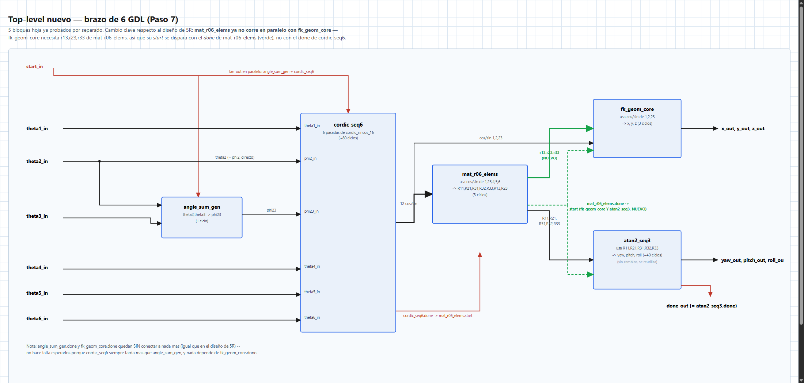
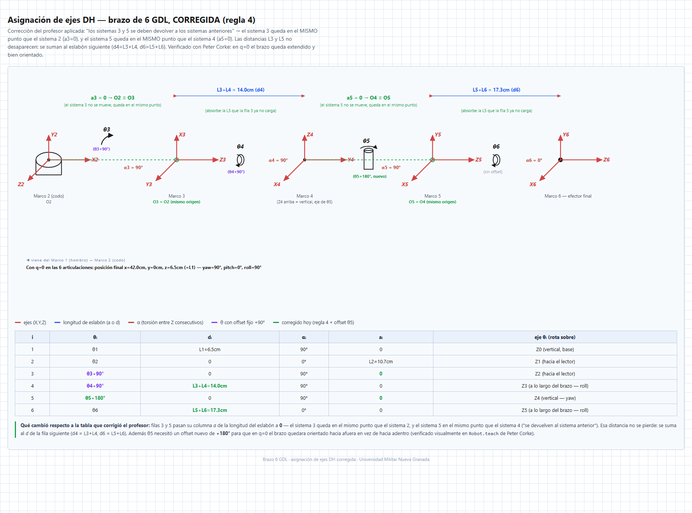
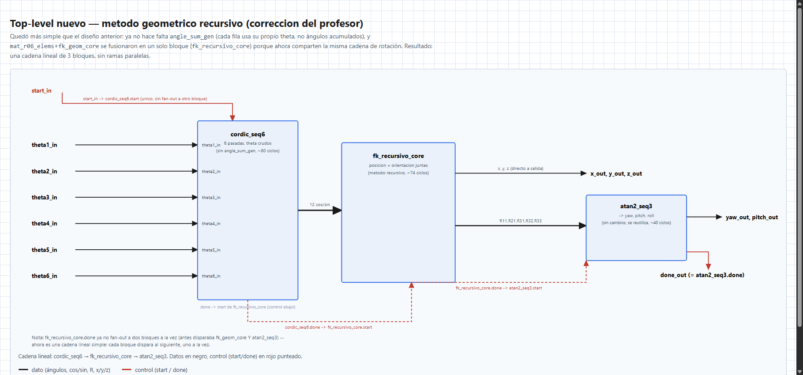
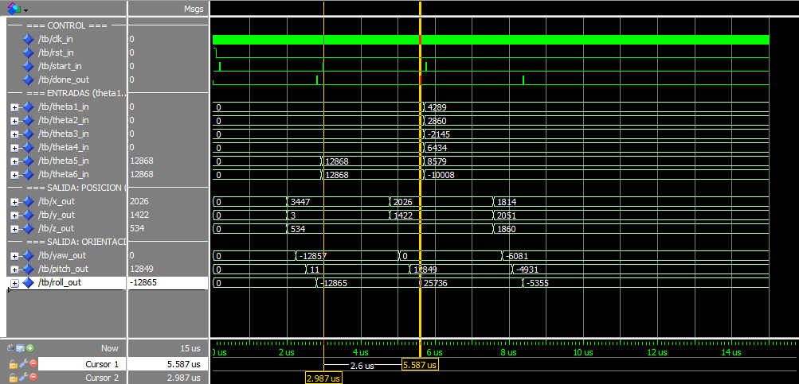
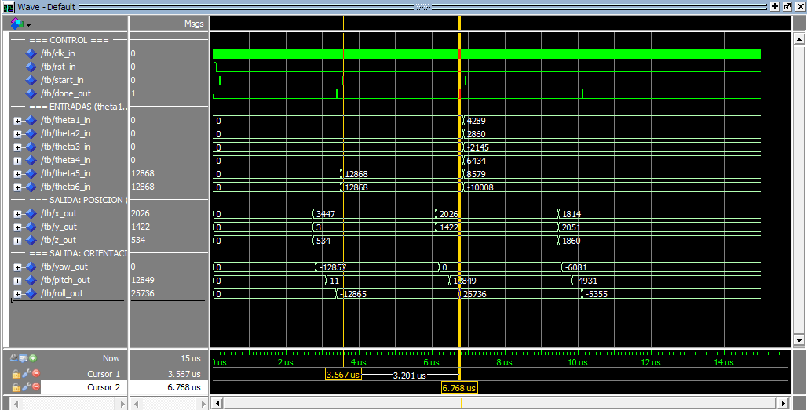

# Cinemática Directa 6 GDL Real por Método Geométrico — de `FK_6R_Geometrico` a `FK_7R_Geometrico`

## Descripción General

La [lección 11](../11_Cinematica_Directa_Geometrica/README.md) implementó la cinemática directa
completa (posición + orientación) de un brazo que, a pesar del nombre del proyecto
(`FK_6R_Geometrico`), en realidad tenía **5 articulaciones revolutas + un roll de gripper** — la
muñeca no aportaba grados de libertad propios en el sentido estricto.

El diseño mecánico cambió: el brazo real del semillero tiene **6 articulaciones revolutas
independientes**. Este documento cubre todo lo que cambió al pasar de un brazo a otro:

1. Una tabla DH nueva, corregida por el profesor sobre la marcha.
2. Un hallazgo matemático importante: la posición del efector **deja de ser independiente de la
   muñeca** (algo que sí era cierto en el brazo de 5R y que simplificaba mucho el diseño anterior).
3. Un rediseño completo del VHDL: un bloque de orientación nuevo, una entrada nueva en el
   diagrama de bloques, y **una crisis de recursos real** (el diseño ingenuo no cabía en la FPGA)
   con su causa raíz medida y su arreglo.
4. **Una segunda corrección del profesor**, después de mostrarle el diseño ya funcionando: el
   atajo trigonométrico de la sección 3 (aunque daba los números correctos) no era un método
   reconocible, así que la posición se rehízo con el método geométrico recursivo estándar
   (`Inversa2R.pdf`) — en FPGA, MATLAB y STM32 a la vez (sección 3.1).

> **Aritmética:** Punto fijo Q2.13 (16 bits con signo), igual que en el resto del semillero.
> **Plataforma:** Cyclone IV E (EP4CE6E22C8) · Quartus 18.1
> **Universidad Militar Nueva Granada**

---

## Tabla de Contenidos

1. [La corrección del profesor: "regla 4"](#1-la-correccion-del-profesor-regla-4)
2. [Tabla DH nueva](#2-tabla-dh-nueva)
3. [El hallazgo: la posición ya no es independiente de la muñeca](#3-el-hallazgo-la-posicion-ya-no-es-independiente-de-la-muñeca)
   - 3.1 [Segunda corrección: el método recursivo de verdad (`Inversa2R.pdf`)](#31-segunda-correccion-el-metodo-recursivo-de-verdad-inversa2rpdf)
4. [Orientación: R0_6 y su reducción algebraica](#4-orientacion-r0_6-y-su-reduccion-algebraica)
5. [Arquitectura de módulos y el diagrama de conexión nuevo](#5-arquitectura-de-modulos-y-el-diagrama-de-conexion-nuevo)
6. [La crisis de recursos: cuando el diseño "correcto" no cabe en el chip](#6-la-crisis-de-recursos-cuando-el-diseno-correcto-no-cabe-en-el-chip)
7. [Verificación: ModelSim y MATLAB](#7-verificacion-modelsim-y-matlab)
8. [Comparación de recursos, de punta a punta](#8-comparacion-de-recursos-de-punta-a-punta)
9. [Cómo compilar y simular](#9-como-compilar-y-simular)
10. [Comparación con STM32: hardware dedicado vs. software, y el efecto del reloj](#10-comparacion-con-stm32-hardware-dedicado-vs-software-y-el-efecto-del-reloj)

---

## 1. La corrección del profesor: "regla 4"

Al presentar la asignación de ejes DH del brazo de 6 GDL, el profesor corrigió: *"los sistemas
coordenados 3 y 5 se deben devolver a los sistemas coordinados anteriores por la regla 4"*.

Interpretación aplicada (regla clásica de asignación DH: cuando el sistema de referencia de un
eslabón tiene libertad de orientación, se elige igual al del eslabón anterior en vez de
introducir un giro nuevo): el sistema 3 se hace **coincidir** con el sistema 2, y el sistema 5
con el sistema 4 — ninguno de los dos avanza por su cuenta. La distancia que antes recorrían
esos ejes no desaparece: se acumula en el eslabón **siguiente**.

Se verificó primero en MATLAB con Peter Corke (`Metodo_DH_Peter_6R.m`, `Robot.teach`) antes de
tocar ningún VHDL — con la tabla original (sin la corrección) el brazo no se dibujaba bien en
`q=0`; con la corrección, sí.

---

## 2. Tabla DH nueva

| i | θᵢ | dᵢ | αᵢ | aᵢ |
|---|---|---|---|---|
| 1 | θ1 | L1 = 6.5 cm | π/2 | 0 |
| 2 | θ2 | 0 | 0 | L2 = 10.7 cm |
| 3 | θ3+π/2 | 0 | π/2 | 0 |
| 4 | θ4+π/2 | L3+L4 = 14.0 cm (`Ld4`) | π/2 | 0 |
| 5 | θ5 | 0 | -π/2 | 0 |
| 6 | θ6 | L5+L6 = 17.3 cm (`Ld6`) | 0 | 0 |

Cambios respecto a la tabla original (antes de la corrección): filas 3 y 5 pasan su columna `a`
de la longitud del eslabón a `0` (los sistemas 3 y 5 no se mueven, "se devuelven" al sistema
anterior); esa distancia se suma al `d` de la fila siguiente (`d4 = L3+L4`, `d6 = L5+L6`).

**Verificado con `Robot.fkine` en `q = 0`:** brazo extendido, `x = 42 cm`, `y = 0`, `z = 6.5 cm`
(`= L1`), `yaw = -90°`, `pitch = 0°`, `roll = -90°` — la suma total de eslabones horizontales
(`L2+Ld4+Ld6 = 10.7+14.0+17.3 = 42.0 cm`) coincide exacto.

---

## 3. El hallazgo: la posición ya no es independiente de la muñeca

> **Nota:** esta sección documenta el primer intento (el "atajo" trigonométrico). Daba los
> números correctos, pero el profesor lo rechazó por no ser un método reconocible — la versión
> que quedó implementada de verdad es la de la **[sección 3.1](#31-segunda-correccion-el-metodo-recursivo-de-verdad-inversa2rpdf)**.
> Se deja esta sección tal cual porque el hallazgo (la posición ya no es independiente de la
> muñeca) sigue siendo la razón real de por qué el diseño de 5R no alcanzaba.

En el brazo de 5R+gripper, `theta5` era un giro puro que no movía el efector de sitio — por eso
`fk_geom_core` (posición) y `mat_r05_elems` (orientación) podían correr **en paralelo**, dos
ramas totalmente independientes desde `cordic_seq5`.

En el brazo de 6 GDL real esto deja de ser cierto: las filas 4 y 6 de la tabla DH tienen
`d4 = Ld4 = 14 cm` y `d6 = Ld6 = 17.3 cm` — desplazamientos físicos reales, no cero. Cuando
`theta4` o `theta5` giran, mueven literalmente el punto donde termina el brazo.

**Derivación** (misma idea de siempre: hasta el sistema 4 es la misma trigonometría plana de
toda la vida; lo nuevo es el tramo de la muñeca):

```
Parte A — posicion del sistema 4 (identica a la del 5R, pero con Ld4 en vez de L45,
y SIN termino phi234 porque theta4 ya no es coplanar con theta2,theta3 en esta tabla):

  phi2  = theta2
  phi23 = theta2 + theta3
  r4 = L2*cos(phi2) + Ld4*cos(phi23)
  z4 = L1 + L2*sin(phi2) + Ld4*sin(phi23)
  x4 = r4*cos(theta1) ; y4 = r4*sin(theta1)

Parte B — aporte de la muñeca (NUEVO): el desplazamiento d6=Ld6 en DH siempre ocurre a lo
largo del eje Z del sistema anterior (Z5). Como alpha6=0, Z6=Z5 -- y la tercera columna de
CUALQUIER matriz de rotacion R0_i es, por definicion, el eje Z de ese sistema expresado en
el mundo. Como ya hay que calcular R0_6 completa para la orientacion, se reutilizan sus
elementos R13,R23,R33 (columna 3) tambien para la posicion:

  x = x4 + Ld6*R13
  y = y4 + Ld6*R23
  z = z4 + Ld6*R33
```

Esto tiene una consecuencia directa de arquitectura: **`fk_geom_core` necesita `r13,r23,r33`
de `mat_r06_elems`**, así que el bloque de orientación tiene que terminar antes de que arranque
el de posición — ya no pueden correr en paralelo como en el diseño de 5R (ver
[sección 5](#5-arquitectura-de-modulos-y-el-diagrama-de-conexion-nuevo)).

### 3.1 Segunda corrección: el método recursivo de verdad (`Inversa2R.pdf`)

Con el diseño de arriba ya funcionando en ModelSim y en hardware real, se le mostró al profesor.
Su corrección: el atajo (Parte A + Parte B, arriba) daba los números correctos, pero **ni el
profesor ni el estudiante podían seguir la derivación** — no es un método que se enseñe, es un
truco armado a mano para esta tabla DH en particular. El profesor pasó un PDF de referencia
(`Inversa2R.pdf`) con el método que sí quiere: acumular la posición **eslabón por eslabón**,
reutilizando la matriz de rotación acumulada hasta el eslabón anterior — el mismo tipo de
recursión que ya se usa para construir `R0_6` en la sección 4, solo que aplicada también a la
posición:

```
O_0 = [0,0,0] ;  R_0^0 = I
para i = 1..6:
    p_i = [a_i*cos(theta_i'), a_i*sin(theta_i'), d_i]   (offset local del eslabon i)
    O_i = O_(i-1) + R_(i-1)^0 * p_i                       (posicion acumulada)
    R_i^0 = R_(i-1)^0 * R_i                                (rotacion acumulada, R_i = dh_rot(theta_i', alpha_i))
```

Verificado primero en Python (floating point y luego con la aritmética entera truncada de
`mul_q13`, antes de tocar el VHDL): da **exactamente los mismos números** que ya se habían
confirmado con el atajo — no cambió ningún resultado físico, solo la forma honesta de llegar a
él.

**Simplificación favorable que salió al verificar esta tabla DH en particular:** todos los
`alpha_i` de la tabla (sección 2) son múltiplos de 90° (`0`, `+pi/2` o `-pi/2`), así que cada
matriz `R_i = dh_rot(theta_i', alpha_i)` se arma **sin ninguna multiplicación** — solo colocando
`±cos(theta_i')`, `±sin(theta_i')` y ceros en la posición correcta de la matriz 3×3. Y como
`theta_i'` de las filas 3 y 4 es `theta_i + pi/2`, tampoco hace falta correr el CORDIC sobre ese
ángulo desplazado: `cos(theta+pi/2) = -sin(theta)` y `sin(theta+pi/2) = cos(theta)` son
identidades exactas, así que basta el CORDIC de `theta_i` puro y un intercambio/cambio de signo.
Esto además **elimina la necesidad de `angle_sum_gen.vhd`**: ya no hace falta sumar `phi2`/`phi23`
porque cada fila usa su propio `theta_i`, sin acumular con las demás (ver arquitectura nueva en
la [sección 5](#5-arquitectura-de-modulos-y-el-diagrama-de-conexion-nuevo)).

La corrección se aplicó en los **3 sitios** donde vivía el atajo original:

| Sitio | Antes | Ahora |
|---|---|---|
| FPGA (VHDL) | `mat_r06_elems.vhd` + `fk_geom_core.vhd` (2 módulos) | [`fk_recursivo_core.vhd`](fk_recursivo_core.vhd) (1 solo módulo — posición y orientación comparten la misma cadena de rotación, ya no tiene sentido separarlos) |
| MATLAB | Sección "atajo" de `Metodo_Geometrico_RPY_6R.m` | Bucle `O_i = O_(i-1) + R*p_i` en el mismo archivo, reutilizando las matrices `R1,R02..R05` que ya construía la orientación |
| STM32 (`.cpp`) | `x4,y4,z4 + Ld6*(R13,R23,R33)` | Mismo bucle recursivo, con la función `mat3_vec` nueva, reutilizando `R1..R06` que `forward_kinematics()` ya arma |

De paso, el profesor pidió cambiar la **medición de tiempo en STM32**: de `DWT->CYCCNT` a `TIM5`
(reset `CNT`, `CR1|=1` arranca, `CR1&=~1` para, lee `CNT`) — mismo patrón que usa el curso con
I2C, más determinístico con la herramienta estándar. Y pidió un script aparte para reconstruir la
MTH a mano desde los valores Q2.13 que bota ModelSim, para ver cuánto se aleja del ideal por el
redondeo del CORDIC — ambos quedaron en [`Verificador_MTH_ModelSim_6R.m`](Verificador_MTH_ModelSim_6R.m)
y en la [lección 13](../13_Cinematica_Directa_6GDL_STM32/README.md).

---

## 4. Orientación: R0_6 y su reducción algebraica

`R0_6 = R1·R2·R3·R4·R5·R6` (misma construcción matriz-por-matriz que
[`Metodo_Geometrico_RPY_6R.m`](Metodo_Geometrico_RPY_6R.m)) se expandió con un sistema
algebraico (`sympy`, `cse`) para encontrar la forma con menos productos compartidos, y esa
reducción se **verificó numéricamente contra la fórmula completa antes de traducir a VHDL**
(2000 casos aleatorios, error máximo ~1e-16 — redondeo de punto flotante puro, no error real):

```
R11 = c6*(c1*(c23*s5) + c5*t5)  + s6*t6b
R21 = c6*(-c5*t6 + s1*(c23*s5)) + s6*t5b
R31 = -c6*t9 - s6*(c23*c4)
R32 = -c6*(c23*c4) + s6*t9
R33 = (c5*s23) + s4*(c23*s5)
R13 = c1*(c23*c5) - s5*t5
R23 = s1*(c23*c5) + s5*t6
```

con `t5,t5b,t6,t6b,t9` construidos a partir de 9 productos directos de las entradas
(ver comentario completo al inicio de [`mat_r06_elems.vhd`](mat_r06_elems.vhd)).

**Buena noticia:** [`atan2_seq3.vhd`](../11_Cinematica_Directa_Geometrica/atan2_seq3.vhd) (la
extracción de yaw/pitch/roll vía CORDIC, y la estandarización de la singularidad) **no cambió
nada** — las fórmulas `yaw=atan2(R21,R11)`, `pitch=atan2(-R31,ρ)`, `roll=atan2(R32,R33)` y el
umbral de singularidad son genéricas de cualquier matriz de rotación ZYX, sin importar cuántas
articulaciones la generaron.

**La singularidad se mudó de sitio.** En el brazo de 5R, `q=0` (brazo extendido) era el caso de
gimbal lock. En el brazo de 6 GDL, `q=0` da `ρ=1` (perfectamente definido) — la nueva
singularidad aparece en `theta5=90°, theta6=90°` (resto en 0), verificada y usada como caso de
prueba (ver [sección 7](#7-verificacion-modelsim-y-matlab)).

---

## 5. Arquitectura de módulos y el diagrama de conexión nuevo

**Arquitectura original (atajo, sección 3 — histórica):**

| Módulo | Estado | Rol |
|---|---|---|
| [`geom_pkg.vhd`](geom_pkg.vhd) | Actualizado | Constantes `L1,L2,Ld4,Ld6` en Q2.13 |
| `angle_sum_gen.vhd` | Simplificado | Ya no calcula `phi234` (theta4 no es coplanar con 2,3 en esta tabla); `phi2` ya no hace falta calcularlo, es literalmente `theta2` |
| `cordic_seq6.vhd` (v1) | Nuevo | 6 pasadas de `cordic_sincos_16` (antes 5): theta1, phi2, phi23, theta4, theta5, theta6 |
| `mat_r06_elems.vhd` | Nuevo | Los 7 elementos de R0_6 (sección 4) |
| `fk_geom_core.vhd` (v1) | Reescrito | Posición (sección 3) — dependía de `mat_r06_elems` |
| `atan2_seq3.vhd` | Sin cambios | Se reutiliza tal cual de la lección 11 |

La conexión que **no existía** en el diseño de 5R: `mat_r06_elems` → `r13,r23,r33` →
`fk_geom_core`, y el `done` de `mat_r06_elems` disparando el `start` de **ambos**
`fk_geom_core` y `atan2_seq3` (antes ese fan-out salía directo del `done` de `cordic_seq5`).





**Arquitectura actual (método recursivo, sección 3.1):** con la posición y la orientación
compartiendo la misma cadena `R_i^0 = R_(i-1)^0 * R_i`, ya no hay razón para tener dos módulos
separados corriendo en serie con fan-out — quedó una **cadena lineal de 3 bloques**, más simple
que la de arriba:

| Módulo | Estado | Rol |
|---|---|---|
| [`cordic_seq6.vhd`](cordic_seq6.vhd) | **Reescrito** | 6 pasadas de `cordic_sincos_16` sobre `theta1..theta6` **crudos** — ya no suma ángulos, así que `angle_sum_gen.vhd` **se elimina** del proyecto |
| [`fk_recursivo_core.vhd`](fk_recursivo_core.vhd) | **Nuevo** (reemplaza a `mat_r06_elems.vhd` + `fk_geom_core.vhd`) | Construye `R_i^0` y `O_i` eslabón por eslabón (sección 3.1); un solo `mul_q13(...)` reutilizado en 74 pasos secuenciales (mismo patrón "un multiplicador en serie" de la sección 6) |
| `atan2_seq3.vhd` | Sin cambios | Se reutiliza tal cual |

`angle_sum_gen.vhd`, `mat_r06_elems.vhd` y `fk_geom_core.vhd` quedan retirados del proyecto
Quartus y de esta carpeta (siguen disponibles en el historial de git de este repo para quien
quiera comparar el diseño anterior).



---

## 6. La crisis de recursos: cuando el diseño "correcto" no cabe en el chip

La primera versión de `mat_r06_elems.vhd` y `fk_geom_core.vhd` implementaba las fórmulas de la
sección 4 **tal cual se leen**: cada producto de la fórmula, una llamada a `mul_q13(...)`
directa, repartida en 3 etapas de pipeline (mismo estilo que la lección 11). Matemáticamente
perfecta — confirmada en ModelSim con los mismos 3 casos de prueba de siempre. Al compilar en
Quartus:

| | Reportado |
|---|---|
| Total logic elements | **9,118 / 6,272 (145 %)** |
| Embedded Multiplier 9-bit elements | 30 / 30 (100 %) |
| **Flow Status** | **Failed** |

No cabe en la FPGA — el mismo tipo de fracaso que tumbó al método DH original en la lección 7,
esta vez a menor escala.

### Causa raíz (medida, no supuesta)

`mat_r06_elems.vhd` (v1) tenía **31** expresiones `mul_q13(...)` escritas como líneas de código
distintas (una por producto de la fórmula), y el nuevo `fk_geom_core.vhd` tenía **9** más — 40
multiplicaciones de 16 bits en total, contra solo 15 en el diseño de 5R
(`mat_r05_elems`=7 + `fk_geom_core` viejo=8).

El dato clave para entender **por qué** eso duele tanto: Quartus construye **un árbol de
compuertas dedicado por cada expresión de multiplicación distinta que aparece en el código
fuente** — no detecta automáticamente que 31 líneas con nombres de destino diferentes, dentro
de una máquina de estados donde solo una corre a la vez, podrían compartir el mismo hardware.
Cada árbol de 16×16 bits en lógica pura cuesta cientos de elementos lógicos. Prueba de esto: el
conteo de multiplicadores **embebidos** (hardware dedicado del chip) se quedó fijo en **4/30
tanto en el diseño de 5R como en el 6R ya arreglado** — ese "4" resulta ser, en los dos casos,
exactamente la única multiplicación de `cordic_atan2_16.vhd` (la corrección de ganancia del
CORDIC, una sola línea `mul_q13` en todo ese archivo, reutilizada). Es decir: **ninguna** de las
multiplicaciones de `mat_r0X_elems`/`fk_geom_core` usó nunca hardware dedicado, ni en el diseño
bueno de 5R ni en el malo de 6R — la diferencia completa entre 1,754 LEs y 9,118 LEs es
la diferencia entre construir **15** árboles de compuertas de multiplicación en total o
construir **40**.

### El arreglo: un solo multiplicador, reutilizado en serie

Misma idea que ya usa `cordic_seq6` (un solo `cordic_sincos_16` reutilizado en 6 pasadas en vez
de 6 en paralelo), aplicada a la multiplicación: **una sola línea `mul_q13(...)` en todo el
archivo**, con los operandos seleccionados por un `case` sobre un contador de paso, reutilizada
en 31 ciclos secuenciales para `mat_r06_elems` (9 para `fk_geom_core`). Al haber un único
punto de llamada en el código fuente, Quartus solo puede construir un único árbol de
compuertas — lo comparte por construcción, no por optimización esperada.

Antes de tocar el VHDL, la secuencia completa de 31/9 pasos se verificó **bit a bit en Python**
contra los mismos valores que ya se habían confirmado en ModelSim con la versión paralela —
para no arriesgar un error de reordenamiento en un cambio tan grande.

| | Antes (v1, paralelo) | Después (v2, serial) |
|---|---|---|
| Total logic elements | 9,118 / 6,272 (**145 %**) | **3,759 / 6,272 (60 %)** |
| Total registers | 2,053 | 2,393 |
| Embedded Multiplier 9-bit elements | 30 / 30 (100 %) | 4 / 30 (13 %) |
| Latencia `mat_r06_elems` | 3 ciclos | ~32 ciclos |
| Latencia `fk_geom_core` | 3 ciclos | ~11 ciclos |
| Latencia total (medida en ModelSim) | ~2.6 µs | ~3.2 µs |
| **Flow Status** | **Failed** | Failed (ver nota de pines abajo) |

Se sacrificó velocidad (la cadena completa pasa de ~130 a ~160 ciclos, ~23 % más lenta) a
cambio de 2.4× menos elementos lógicos — el mismo criterio de "área sobre velocidad" que ha
guiado todo este proyecto desde que se abandonó el método DH.

**Nota — `Flow Status` sigue en `Failed`, y es esperado:** el `Fitter` todavía falla, pero ya
no por LEs — es por **pines** (`Total pins: 196/92, 213%`). Este es el mismo problema, ya
documentado, de la [lección 11](../11_Cinematica_Directa_Geometrica/README.md) (ahí eran 116
pines sobre 92 disponibles, con 5 entradas theta; con 6 entradas theta ahora son 196) — expone
demasiadas entradas de 16 bits en paralelo para los pines de E/S reales del `EP4CE6E22C8`
(TQFP144, 92 pines de usuario). Sigue **fuera de alcance** de esta lección, deliberadamente,
igual que se decidió con el profesor en la lección 11 — es un problema de asignación de pines
físicos (o de empaquetar las entradas en un bus serie), no de la arquitectura de cómputo.





### La lección no se repitió: `fk_recursivo_core` nació con un solo multiplicador

Al rehacer la posición con el método recursivo (sección 3.1), `fk_recursivo_core.vhd` fusiona lo
que antes eran dos módulos y hace **74 pasos** de multiplicación (más que los 40 combinados de
`mat_r06_elems`+`fk_geom_core` v1) — pero esta vez se escribió **desde el principio** con el
patrón de un solo `mul_q13(...)` reutilizado en serie, no como una segunda crisis a corregir
después. Resultado, con Analysis & Synthesis:

| | `mat_r06_elems`+`fk_geom_core` v2 (serie, sección anterior) | `fk_recursivo_core` (recursivo, desde el principio) |
|---|---|---|
| Total logic elements | 3,759 / 6,272 (60 %) | **4,445 / 6,272 (71 %)** |
| Total registers | 2,393 | 2,913 |
| Embedded Multiplier 9-bit elements | 4 / 30 (13 %) | 2 / 30 (7 %) |
| Latencia total (medida en ModelSim) | ~3.2 µs | ~4.05 µs |

Más pasos (74 vs 40) porque el método recursivo hace más aritmética explícita en vez del atajo —
es una ganancia de **claridad**, no de velocidad ni de recursos: sigue cabiendo cómodo (71 %) sin
haber pasado nunca por una versión "en paralelo" que fallara primero.

---

## 7. Verificación: ModelSim y MATLAB

Con el método recursivo (sección 3.1) se verificó en **dos niveles**, separando la aritmética de
la cadena de matrices del ruido del CORDIC:

**Nivel 1 — módulo `fk_recursivo_core` aislado**, alimentado a mano con los cos/sin Q2.13 "ideales"
(sin pasar por CORDIC), comparado contra la misma secuencia de 74 pasos verificada bit a bit en
Python con aritmética entera truncada (`mul_q13`) y semántica de registro real — coincidencia
**exacta**, como debe ser cuando la entrada ya es la misma en ambos lados:

| Caso | Entradas (grados) | R11,R21,R31,R32,R33 | x,y,z |
|---|---|---|---|
| A — extendido | todo 0 | 0,-8192,0,-8192,0 | 3441, 0, 532 |
| B — singularidad | th5=90 th6=90, resto 0 | 0,0,-8192,0,0 | 2024, 1417, 532 |
| C — genérico | th1=30 th2=20 th3=-15 th4=45 th5=60 th6=-70 | 4972,-4560,4646,-4105,5355 | 1813, 2049, 1856 |

**Nivel 2 — cadena completa** (`cordic_seq6` → `fk_recursivo_core` → `atan2_seq3`, top-level
`FK_7R_Geometrico_Con_Posicion`), con los mismos 3 casos pero pasando el ángulo real por el
CORDIC:

| Caso | x,y,z medido | Diferencia vs. nivel 1 | yaw,pitch,roll medido |
|---|---|---|---|
| A — extendido | 3449, 3, 537 | ≤ 8 unidades Q2.13 (<0.1 %) | -12857, 19, -12857 |
| B — singularidad | 2027, 1422, 535 | ≤ 5 unidades Q2.13 | 0, 12841, 25736 |
| C — genérico | 1813, 2050, 1862 | ≤ 3 unidades Q2.13 | -6089, -4939, -5347 |

La diferencia entre niveles es el redondeo normal del CORDIC (13 iteraciones) — ocurre incluso en
`theta=0`, porque el algoritmo no tiene un caso especial para ángulo cero: igual gira y converge
por las 13 iteraciones, dejando un residuo de pocos LSB. Latencia medida en el nivel 2: **~4.05 µs**
por cálculo completo (ver sección 6).

**Verificación cruzada en MATLAB:** [`Metodo_Geometrico_RPY_6R.m`](Metodo_Geometrico_RPY_6R.m)
reproduce los 3 casos de arriba con el método recursivo (comentario al inicio del archivo con los
valores exactos de `theta1..theta6` a usar para cada uno) y reconstruye `Rz(yaw)·Ry(pitch)·Rx(roll)`
contra `R0_6` como chequeo independiente. [`Metodo_DH_Peter_6R.m`](Metodo_DH_Peter_6R.m) valida la
tabla DH completa con el toolbox de Peter Corke (`Robot.fkine`, `Robot.teach`).

**Verificación manual del error de CORDIC:** [`Verificador_MTH_ModelSim_6R.m`](Verificador_MTH_ModelSim_6R.m)
es el script que pidió el profesor — se le copian a mano los 6 valores Q2.13 que bota ModelSim
(`x,y,z,yaw,pitch,roll` del nivel 2) y reconstruye la MTH 4×4 para compararla contra la MTH ideal
del mismo caso, cuantificando visualmente cuánto se alejó el resultado por el redondeo del CORDIC
(con los valores de la tabla de arriba, el error de norma queda del orden de 1e-4 — despreciable).

---

## 8. Comparación de recursos, de punta a punta

| Método | Logic elements | % del EP4CE6 | Fitter |
|---|---|---|---|
| DH clásico, matrices 4×4 (lección 7) | 55,391 | 883 % | Failed |
| Geométrico, 5R+gripper (lección 11) | 1,754 | 27 % | OK |
| Geométrico, 6 GDL real — v1 (multiplicadores en paralelo) | 9,118 | 145 % | Failed |
| Geométrico, 6 GDL real — v2 (multiplicadores en serie, atajo) | 3,759 | 60 % | Failed (solo por pines, ver sección 6) |
| Geométrico, 6 GDL real — v3 (**método recursivo**, corrección del profesor, sección 3.1) | **4,445** | **71 %** | Failed (solo por pines, ver sección 6) |

El salto de 1,754 a 3,759 LEs (2.1×) entre el brazo de 5R y el de 6 GDL real es genuino y
esperado — hay una articulación más y la orientación real necesita bastante más álgebra (sección
4) — no es un síntoma de mal diseño. El salto a 9,118 (v1) sí lo era, y quedó documentado en la
sección 6 con su causa raíz medida, no solo su síntoma. El salto de v2 a v3 (3,759 → 4,445, 18 %
más) es el costo de hacer 74 pasos explícitos en vez del atajo de 40 — aceptable a cambio de un
método que el profesor sí puede seguir.

---

## 9. Cómo compilar y simular

1. Abrir el proyecto `FK_6R_Geometrico.qpf` en Quartus 18.1.
2. Generar/actualizar símbolos de los `.vhd` de esta lección (`File > Create/Update > Create
   Symbol Files for Current File`) si se van a editar más adelante.
3. El top-level actual es `FK_7R_Geometrico_Con_Posicion.bdf` — cadena lineal según el diagrama
   de la sección 5 (`cordic_seq6` → `fk_recursivo_core` → `atan2_seq3`).
4. Correr solo **Analysis & Synthesis** (`Processing > Start > Start Analysis & Synthesis`), no
   `Start Compilation` completo — el `Fitter` va a fallar por pines (sección 6, nota de pines),
   no por LEs; Analysis & Synthesis ya da el conteo de recursos (~71 %) sin necesitar que el
   Fitter le asigne pines reales a las 196 señales del top-level.
5. Generar el `.vhd` del top-level si hace falta simular: con el `.bdf` abierto,
   `File > Create/Update > Create HDL Design File for Current File` (VHDL).
6. En ModelSim, `do simular.do` desde la carpeta del proyecto — corre los 3 casos de la
   sección 7 y los imprime en el Transcript. Hay dos `simular.do`/`tb.vhd`: uno para probar
   `fk_recursivo_core` aislado (nivel 1) y otro para la cadena completa sobre
   `FK_7R_Geometrico_Con_Posicion` (nivel 2).

---

## 10. Comparación con STM32: hardware dedicado vs. software, y el efecto del reloj

El puerto completo a STM32 (dos proyectos Keil, mismo código de cinemática, 216MHz vs 16MHz sin
PLL, explicado paso a paso con el log real del UART) quedó documentado aparte en la
**[lección 13](../13_Cinematica_Directa_6GDL_STM32/README.md)**. Resumen del resultado:

| | FPGA (50 MHz) | STM32 @ 216 MHz | STM32 @ 16 MHz |
|---|---|---|---|
| Tiempo (constante / según caso) | ~3.1 µs | 33.5–48.8 µs | 452–659 µs |
| **Veces más lento que la FPGA** | 1× | **10.8×–15.7×** | **146×–212×** |

A pesar de que el STM32 a máxima velocidad tiene un reloj **4.3 veces más rápido** que la FPGA,
termina el mismo cálculo entre **10.8 y 15.7 veces más lento** — hardware dedicado en pipeline
le gana por mucho a software secuencial, sin importar cuánto reloj se le meta al software.
